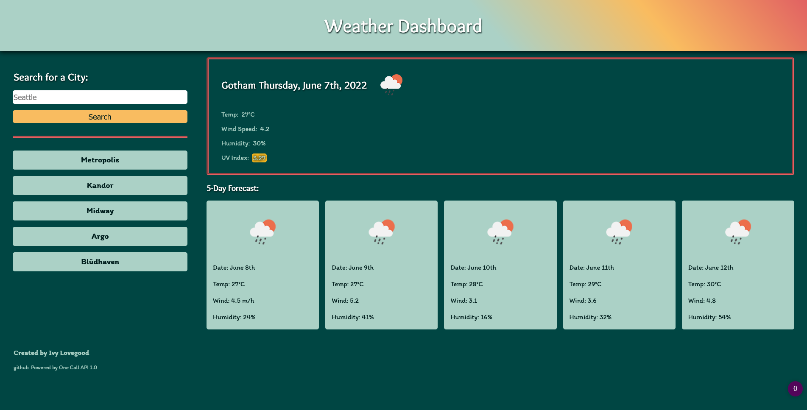

# Weather Dashboard

**What does it do?**

- This weather dashboard will allow you to search for the weather in any city and see the current weather, and the forecast for the next 5 days.

**How does it work?**

- Type the name of your city into the search bar and hit "Search". The application will send your search request to the openweather geocode api and return the country (and state, if in the US), and the search field will be populated with the updated information. Then, a request is sent to the One Call API which will return the weather data and forecast for the requested city. The relevant weather data will be displayed in the main section of the webpage, and the five-day forecast will be displayed in cards underneath the current weather. Your previous searches will be displayed as labels under the search button. Clicking one of these labels will run another search for the current information. The previous searches will not display the same city twice.

**Screenshot**

**Link to deployed Project**
Website: https://love-ivy.github.io/ILW6Weather/
GitHub Repository: https://github.com/Love-Ivy/ILW6Weather

**Technologies Used**

- html
- css
- javascript
- openweather geocode api
- one call api 1.0

**Contributor Roles**
Created by Ivy Lovegood
